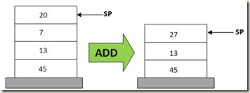

# 基于栈和基于寄存器的虚拟机架构对比，以及Dalvik虚拟机

虚拟机是在本地操作系统之上更高层的抽象，模拟了一个物理机。这里，我们讲的是进程虚拟机，而不是系统虚拟机。虚拟机能让相同的平台运行在多种操作系统和硬件体系上。Java和Python的解释器可以作为一个例子，代码在这些解释器中会被编译成他们虚拟机指定的字节码。微软的.Net体系也会为CLR(Common Language Runtime)把代码编译成中间代码。

一个虚拟机一般要怎样实现呢？虚拟机需要模拟一个物理CPU执行的操作，所以，最少可以有下面几个方面：

* 编译 - 把源语言的代码编译成虚拟机指定的字节码
* 数据结构 - 包含指令和操作数（操作数将被指令处理）
* 调用栈 - 函数调用操作所需的调用栈
* 指令指针 - 指向下一个要执行的指令
* 虚拟CPU - 指令处理器
    * 获取下一个指令（通过指令指针查找）
    * 解读操作数
    * 执行指令

有两种主要的方法实现虚拟机：基于栈和基于寄存器。基于栈的例子有JVM，.Net CLR，基于栈的方式是被最广泛使用的虚拟机实现方式。基于寄存器实现的虚拟机有Lua VM和Dalvik VM。这两种虚拟机实现方式使用了不同的机制来存储、获取操作数和他们的结果。

## 基于栈的虚拟机

基于栈的虚拟机实现了前文描述的大多数方面，但是，存储操作数的内存结构是一个栈。虚拟机执行操作时先从栈中拿走数据，处理他们，然后把结果放回栈里（LIFO - 后入先出）。在一个基于栈的虚拟机中，相加两个数的操作一般以下面的方式执行（20，7和相加的结果是操作数）：

    1. 拿走20
    2. 拿走7
    3. 相加20和7，得到结果
    4. 把结果放回栈里

由于拿走和放回操作，所以需要四条指令来执行一个相加操作。这种基于栈的模型有一个优势，操作数被栈指针隐式的定位了（栈指针是上图中的SP）。这意味着虚拟机不必明确的知道操作数的地址了，因为调用栈指针就能得到下一个操作数。在基于栈的虚拟机中，所有的算术运算和逻辑运算都是通过在栈中拿走、放回操作数和结果执行的。

## 基于寄存器的虚拟机

在基于寄存器实现的虚拟机中，存储操作数的数据结构是基于CPU的寄存器的。这里没有拿走和放回操作，但是指令需要包含操作数的地址（寄存器）。这意味着，指令的操作数要在指令里被明确的定位，这不像基于栈的模型中有一个栈针来定位操作数。例如，如果要在一个基于寄存器的虚拟机中执行一个相加操作，差不多会是下面这样的指令：

    1. ADD R1, R2, R3 ;        # Add contents of R1 and R2, store result in R3

就像我上面提到的，没有拿走和放回操作，所以相加操作的指令只有一行。和栈不同，我们需要以R1，R2和R3来明确的告知操作数的地址。这种方式的优点是不用频繁的在一个栈中拿走和放入数据，而且基于寄存器的虚拟机中的指令在指令调度loop中执行的更快。

另一个基于寄存器模型的优点正是基于栈模型无法做到的一些优化。一个这样的实例是，当代码中有子表达式时，寄存器模型可以只计算一次，并把结果存到一个寄存器中，等到下次该子表达式再出现时，可以直接用这个结果，减少了子表达式重复计算的花费。

基于寄存器模型的问题是寄存器指令比栈指令大，因为我们需要在寄存器的指令里明确的指明操作数的地址。栈的指令很短是因为栈针操作，相应的，寄存器的指令要包含操作数地址会很大，这也导致了比栈代码大的寄存器代码。

